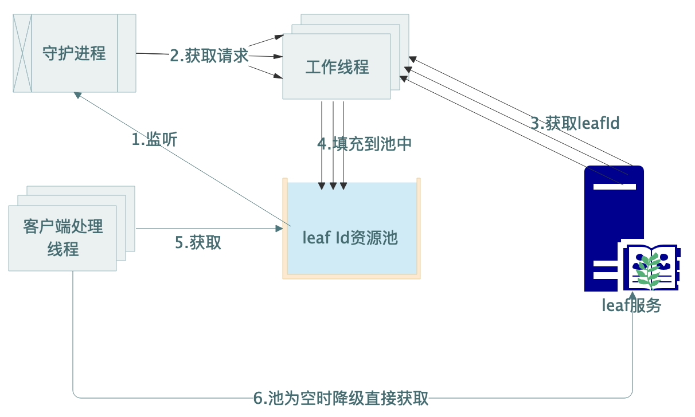

# 应用优化

[TOC]


## 背景

​		在实际应用过程中，无论是通过rpc还是http调用，都会存在一定的网络耗时，同时会存在请求毛刺。可以通过本地客户端预先缓存一定数量ID，定时计算填充，将原来的网络获取改为内存获取，稳定又高效。这种优化思路可以适用于很多这种网络调用场景中，我们姑且称为资源池化。

## 方案设计

需要关注的几个点

1. 数据结构选型

   选择一种数据结构作为资源池缓存ID资源，这里选用JDK自带的ArrayBlockingQueue，有以下优点

   - 并发队列，无需关心并发控制，实现简单
   - 有限队列，可以减少垃圾回收
   - 获取size，O=1

   性能不足时，可以考虑将ArrayBlockingQueue替换成ringbuffer或者建立两个arrayBlockingQueue将读写分离。

2. 如何检测

   1. 获取元素时填充，获取元素时检查队列大小，决定是否填充
      - 优点：实现更简洁
      - 缺点：高并发场景下容易触发大量填充，不好控制
   2. 周期填充，额外开启一个守护线程，定时监听池中资源
      - 优点：获取和填充逻辑分离，更加清晰，获取速率可控
      - 缺点：额外线程定时轮询

3. 如何填充

   检测到资源不足时，异步开启线程批量获取ID，考虑到向池中填充时会有锁竞争，因而**一定数量内的ID获取可以通过单线程多次获取，而随着池中资源所剩比例降低再开启多条线程**。

   ```java
   //计算所需线程数,50%以下才会开启多条线程
   int count = Math.min(100 / percnet,THREAD_COUNT);
   //计算每条线程所需获取次数
   int times = (100 - percnet) / 10;
   ```

   

   ## 流程设计

   流程如下



1. 创建守护线程监听池中资源大小
2. 计算池中所剩资源比例，以及拉取策略
3. 开启工作线程获取资源
4. 将资源填充到池中
5. 客户端直接到池中获取资源
6. 若池中无可用资源，降级为单次获取

## 代码实现

填充伪代码如下：

```java
private static final int THREAD_COUNT = 4;
class LeafIdPoolCheckThread extends Thread {
    @Override
    public void run() {
        while (true) {
            try {
              //每隔100ms检测池中所剩资源
                int sleep = SLOW_PRODUCE_THREAD_SLEEP;
                supplementId();
                Thread.sleep(sleep);
            } catch (Exception e) {
                logger.error("get leaf ids error {}", e);
            }
        }
    }
}


private void supplementId() {
    int poolSize = pooledLeafIdsQueue.size();
    //获取池中ID百分比
    int percnet =100 * poolSize / POOL_SIZE ;
    if (percnet == 0) {
        percnet = 100 * LEAF_MAX_COUNT / POOL_SIZE ;
    }
    //计算所需线程数
    int count = Math.min(100 / percnet,THREAD_COUNT);
    //计算每条线程所需获取次数
    int times = (100 - percnet) / 10;
    if(times <1){
        count = 0;
    }else {
        logger.info("current pool size {}" ,poolSize);
    }
    for (int i = 0; i < count; i++) {
        fixedThreadPool.execute(new LeafIdPoolThread(times));
    }
}
```

获取ID代码如下：

```java
public long nextSnowflakeId() {
    Long id = getNextSnowflakeIdFromPool();
    if (id == null || id < 0) {
        id = getNextSnowflakeIdFromRemote();
    }
    return id;
}
```

## 效果

4核CPU，8G内存机器客户端，可轻松承载1w+QPS本地获取操作。