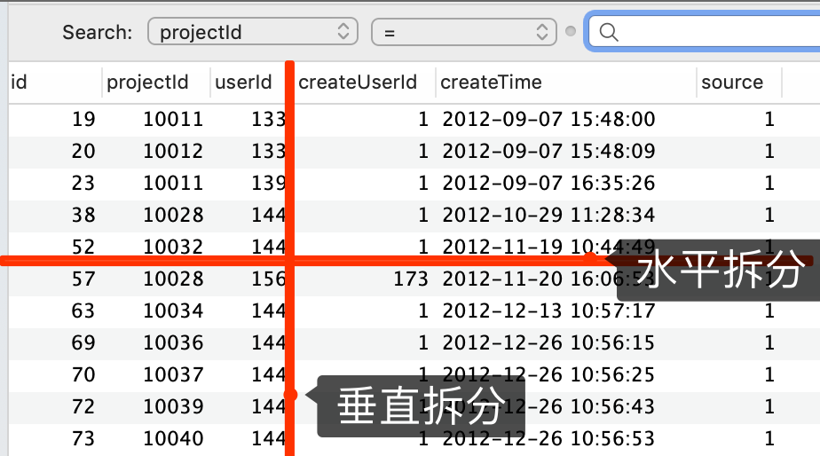

# MySql-分库分表

[TOC]

## 为什么需要分库分表

mysql单表存在性能瓶颈，随着数据量增大，达到某个阈值时（通常为1000w，随不同数据库主机以及具体库表结构略有差别，以实测为准）性能开始下降。主要由于索引达到一定数量级之后，B+数层级过深，会影响查询效率，同时全表扫描更是噩梦。为保证数据库在最佳的性能状态，需将数据进行拆分，维持数据规模。

## 分区与分库分表

  要了解分库分表，首先看一下分区，作为存储引擎实现一种拆分方案，可以帮助我们更加理解分库分表

### 分区

**何为分区**

分区表实际上是存储引擎将一个逻辑表拆分为多个物理表，创建表时指定分区，由存储引擎实现物理表数据的管理。分区可以不依赖中间件，由数据库引擎完成，应用程序没有感知，无需改动。

**如何拆分**

目前MySQL支持范围分区（RANGE），列表分区（LIST），哈希分区（HASH）以及KEY分区四种。

- Range，以某个时间范围划分

```sql
CREATE TABLE tb_demo(
    id INT,
    hiredate DATETIME
) 
PARTITION BY RANGE (TO_DAYS(hiredate) ) (
    PARTITION p1 VALUES LESS THAN ( TO_DAYS('20171202') ),
    PARTITION p2 VALUES LESS THAN ( TO_DAYS('20171203') ));
```

- List，以某个数字区段划分

```sql
create table tb_demo( 
　　a int(11), 
　　b int(11))
　　(partition by list (b) 
　　partition p0 values in (1,3,5,7,9), 
　　partition p1 values in (2,4,6,8,0));
```

- Hash，以某个字段hash结果分区

```sql
CREATE TABLE tb_demo (
    id INT NOT NULL,
    fname VARCHAR(30)
)
PARTITION BY HASH(id)
PARTITIONS 4;
```

还有LINEAR HASH，相比于HASH数据分布更加不均匀，但是容易迁移，可以理解为LIST与HASH的折中

- KEY，以某列或某几列MD5值计算结果分区

```sql
CREATE TABLE tb_demo (
    id INT NOT NULL PRIMARY KEY,    
    name VARCHAR(20)
)
PARTITION BY KEY()
PARTITIONS 2;
```

**验证分区**

通过查询计划，在explain命令之后添加partitions，利用分区裁剪功能可以找到partitions字段内涉及到的具体分区

``` sql
explain partitions 
```

分区本身


分库分表与分区思想基本一致，只不过将路由规则交给数据库中间件。

### 分表分表

原理上与分区类似，通过给逻辑表加上数字索引，将原本的一张逻辑表内数据分散到多张物理表中。

分库与分表的区别在于分表数据仍然在一个数据源上，实现以及维护简单。当数据或流量达到一定规模之后，超过单个数据库实例最大承受限度，此时分表已无济于事，就需考虑分库了。按照排列组合可以分为以下三种。

- 只分库
- 只分表
- 分库分表

#### 分表/分表拆分方式

按照维度通常可分为水平拆分以及垂直拆分



##### 垂直拆分

实际上是对表结构的拆分，将字段分散到多个表中。

- 按职能：保持单表职能结构清晰
- 按性能：将大字段或不常用字段剥离，保证主表性能。同时可减少磁盘存储跨页问题，提高IO性能

##### 水平拆分

实际上是对数据的拆分，将数据分散到多个表中。保证单表数据规模，从而保证数据库性能。在不同的业务场景下，需要选择不同的拆分维度。

水平分表需提供一个或多个字段作为分表键，通过分表键建立数据和表索引的映射关系，包括读写操作(即哪条数据该写入到哪张表，该从哪张表里读取数据)。

#### 分库/分表拆分规则

1. **哈希**

通过某种hash规则，动态计算数据和表的映射关系，数据打散，比如

- id%10
- 

- 优点：
  - 负载均衡，数据会分散在多张表中，读写压力自然也会均摊到多张表中，间接实现负载。数据量散列均衡，每个表的数据量大致相同。请求压力散列均衡，不存在访问热点
- 缺点
  - 表索引变更，当需要增加或减少分表时，数据需要rehash来建立与表的映射关系，涉及到大量数据迁移，因此尽量一次就分够


2. **范围**

具体可以按id进行范围分表，比如id为1-1000000分到一张表，1000000-2000000分到一张表，适合存储日志或者记录等信息，或者按照时间范围分表，比如每月一张表

- 优点
  - 数据迁移影响范围小
- 缺点
  - 单表性能压力，理论上数据规模不大影响不大。无法解决热点问题，如果某一段数据访问QPS特别高，就会落到单表上进行操作
  - 索引表，对于时间范围分表，通常还会通过主键查询的需求，这样就不得不建立

3. **映射表**

建立映射表，建立分表键与表索引的映射关系，通常用于业务隔离，比如北京的业务放到表0中，上海的业务放到表1中。

#### 分库/分表拆分字段

主要针对水平拆分。这部分主要讨论通过什么字段进行拆分，即分表键的选取。通常一张表的分库分表规则只有一套，所以分表键为一个字段或者一个组合字段。中间件会建立一套分库分表规则，拦截到对应sql后，会通过分表键计算表索引，并对sql语句进行修改，最后分发执行，最终汇总执行结果并返回。

通常我们会按照如下方式进行对sql进行分类，

- 读 select
- 写 insert、update、delete

但是在分库分库分表的情景下，我们还需考虑另一个维度的划分

- 纯写 insert
- 读写 select、update、delete

这样分类是因为除insert操作外其它操作实际上都是先有查询操作的。

对于insert操作，必然会包含这个字段，通过数据库中间件可以轻松实现数据写入，而我们更多需要考虑的是分表对查询带来的影响。对于条件中包含分表键的查询操作，可以根据分库分表规则路由到响应的表中，但是很多业务业务场景查询难免要走两套分表规则。倘若查询条件中不包含分表键，无法获得表索引信息，这时候就需要对每张分表进行查询，最后将所有结果汇总返回，当分表数量很大时，这种方式无疑是非常低效且浪费资源的。我们可以通过如下方式进行改进。

- 信息夹带，将字段进行拼接，放入到分表键中，比如订单Id中保留用户Id信息

- 建立索引表，建立额外的表用于建立查询字段与分表键或者表索引的映射关系，这会引入额外的写操作，索引表可能造成性能瓶颈。

- 建立辅助分表键，通过binlog的方式，按照辅助分表键再同步一份数据。通过辅助分表键查询即可获取到表索引信息


### 总结

本质上分区与分库分表都是通过建立路由规则将原来一张表中的数据拆分到多张表中

分区与分库分表区别

|        | 分区     | 分库分表     |
| ------ | -------- | ------------ |
| 实现   | 存储引擎 | 数据库中间件 |
| 灵活性 | 低       | 高           |

由于分区更为底层，不便调试，不够灵活，所以推荐使用分库分表

#### 何时需要分表

单表数据超过1000w(不同配置和数据库结构可能略有差异)，且持续增长 ——> 水平拆分

表字段臃肿，结构不清晰 ——> 垂直拆分

#### 如何拆分

未达数据库性能上线，可优先考虑分区和分表

## 问题

技术都是有两面性的，分库分表看似美好，但是也会引入额外问题

唯一主键

分布式事务

join

聚合操作

## 应用

同读写分离一样，应用程序与数据库库表之间的关系，需由数据库中间件来支持，与读写分离一节描述类似，通常由代理型以及客户端型两种，关于这两种形式的优劣，这里不再赘述