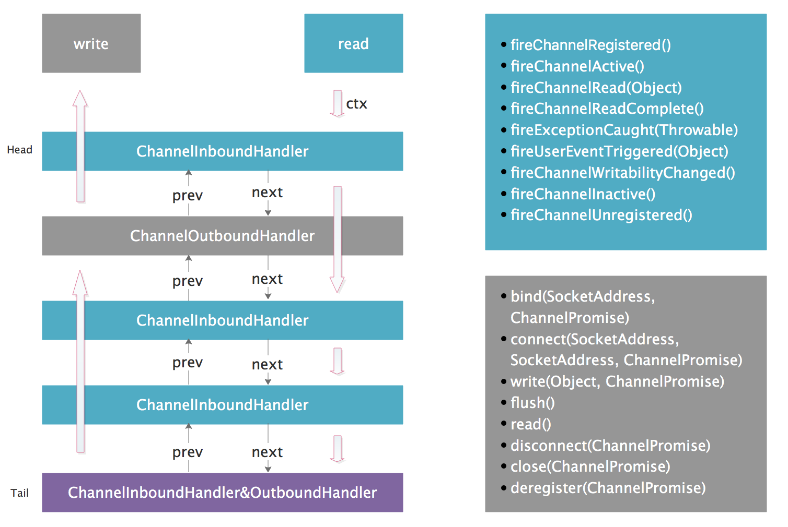

# 线程模型-核心组件

## NioEventLoopGroup

实际上就是一个线程池

## NioEventLoop

本质上是一条NIO线程，

核心运行过程

```java
@Override
protected void run() {
    for (;;) {
        try {
           //判断遍历策略
            switch (selectStrategy.calculateStrategy(selectNowSupplier, hasTasks())) {
                //非阻塞，立即返回
                case SelectStrategy.CONTINUE:
                    continue;
                //阻塞
                case SelectStrategy.SELECT:
                    //wakeup是一个AtomicBoolean类型变量，
                    //getAndSet方法返回旧值，并设置新值,即将当前wakeup传入select()方法后，设置为false
                    select(wakenUp.getAndSet(false));
                    //待wakenUp被重置为true时唤醒
                    if (wakenUp.get()) {
                        selector.wakeup();
                    }
                   
                default:
            }

            cancelledKeys = 0;
            needsToSelectAgain = false;
            //获取IO执行时长占线程运行的比例
            final int ioRatio = this.ioRatio;
            if (ioRatio == 100) {
                try {
                    //处理就绪的socket
                    processSelectedKeys();
                } finally {
                    // 确保task得以执行
                    runAllTasks();
                }
            } else {
                final long ioStartTime = System.nanoTime();
                try {
                    processSelectedKeys();
                } finally {
                    // Ensure we always run tasks.
                    final long ioTime = System.nanoTime() - ioStartTime;
                    runAllTasks(ioTime * (100 - ioRatio) / ioRatio);
                }
            }
        } catch (Throwable t) {
            handleLoopException(t);
        }
        // 处理异常.
        try {
            if (isShuttingDown()) {
                closeAll();
                if (confirmShutdown()) {
                    return;
                }
            }
        } catch (Throwable t) {
            handleLoopException(t);
        }
    }
}
```


继续再看

如何处理

```java
    private void processSelectedKeys() {
        if (selectedKeys != null) {
            processSelectedKeysOptimized();
        } else {
            processSelectedKeysPlain(selector.selectedKeys());
        }
    }
```

```java
private void processSelectedKeysOptimized() {
    for (int i = 0; i < selectedKeys.size; ++i) {
        final SelectionKey k = selectedKeys.keys[i];
       
        //防止通道（channel）意外关闭发生内存泄露
        //SelectionKey[]通过SelectedSelectionKeySet.flip()方法获得，一旦通道关闭
        //SelectedSelectionKeySet可能还持有SelectionKey的强引用，造成不能惠州
        //标记null，一旦通道关闭，数组内元素指向的对象也可以被GC回收掉，
        selectedKeys.keys[i] = null;
        
        //获取key上绑定的对象
        final Object a = k.attachment();
        
        if (a instanceof AbstractNioChannel) {
            processSelectedKey(k, (AbstractNioChannel) a);
        } else {
            @SuppressWarnings("unchecked")
            NioTask<SelectableChannel> task = (NioTask<SelectableChannel>) a;
            processSelectedKey(k, task);
        }

        if (needsToSelectAgain) {
            // null out entries in the array to allow to have it GC'ed once the Channel close
            // See https://github.com/netty/netty/issues/2363
            selectedKeys.reset(i + 1);

            selectAgain();
            i = -1;
        }
    }
}
```

处理就绪的socket

```java
private void processSelectedKey(SelectionKey k, AbstractNioChannel ch) {
    final AbstractNioChannel.NioUnsafe unsafe = ch.unsafe();
    if (!k.isValid()) {
        final EventLoop eventLoop;
        try {
            //获取当前channel绑定的线程
            eventLoop = ch.eventLoop();
        } catch (Throwable ignored) {
            // 如果没有获取到，抛异常，并做忽略处理，这里只是确认
            return;
        }
        // Only close ch if ch is still registered to this EventLoop. ch could have deregistered from the event loop
        // and thus the SelectionKey could be cancelled as part of the deregistration process, but the channel is
        // still healthy and should not be closed.
        // See https://github.com/netty/netty/issues/5125
        if (eventLoop != this || eventLoop == null) {
            return;
        }
        // 如果通道标记invalid则关闭
        unsafe.close(unsafe.voidPromise());
        return;
    }

    try {
        //获取当前selectKey的就绪事件,readyOps
        int readyOps = k.readyOps();
        // We first need to call finishConnect() before try to trigger a read(...) or write(...) as otherwise
        // the NIO JDK channel implementation may throw a NotYetConnectedException.
        //如果OP_CONNECT事件就绪
        if ((readyOps & SelectionKey.OP_CONNECT) != 0) {
            // remove OP_CONNECT as otherwise Selector.select(..) will always return without blocking
            // See https://github.com/netty/netty/issues/924
            
            int ops = k.interestOps();
            ops &= ~SelectionKey.OP_CONNECT;
            k.interestOps(ops);

            unsafe.finishConnect();
        }

        //先处理写事件，如果有写事件的话可以在写出之后释放内存空间，这与写逻辑有关
        if ((readyOps & SelectionKey.OP_WRITE) != 0) {
            //强制写出,若无可写会清除OP_WRITE标志位
            ch.unsafe().forceFlush();
        }
        
        //这里包含==0的情况，为了解决JDK可能导致自旋的bug
        if ((readyOps & (SelectionKey.OP_READ | SelectionKey.OP_ACCEPT)) != 0 || readyOps == 0) {
            unsafe.read();
        }
    } catch (CancelledKeyException ignored) {
        unsafe.close(unsafe.voidPromise());
    }
}
```


Pipeline



Pipeline贯穿了数据的整个处理流程，其结构是双向链表，链表元素为ChannelHandler，即数据的处理过程。

Handler分为InboundHandler和OutBoundHandler两大类，从字面上也很好理解，就服务端而言，InboundHandler负责数据读取和解码过程，即请求的生命周期；OutBoundHandler负责数据的编码和写出过程，响应的生命周期。

链表的构造可以在启动前通过ChannelInitializer接口指定，运行时也可通过链表操作动态调整pipeline结构。

Inbound和OutBound对应不同的事件类型，如上图所示，以read()事件为例，当完成数据的读取，会调用fireChannelRead(Object)方法，将数据传递到Handler中执行

Inbound过程会从头指针HeadChannel开始向后顺序遍历所有的ChannelInboundHandler，并调用其对应的方法，即channelRead()方法，完成这个事件的处理过程，同理，OutBound过程会从TailChannel向前顺序遍历ChannelOutHandler。


前文已经提到，串行化设计,一个selector对应一个NioEventLoop,一个channel只会注册在一个Selector上，被一条线程执行，因而可以，通常一个Handler只会注册在一个pipeline上，而每一个线程


