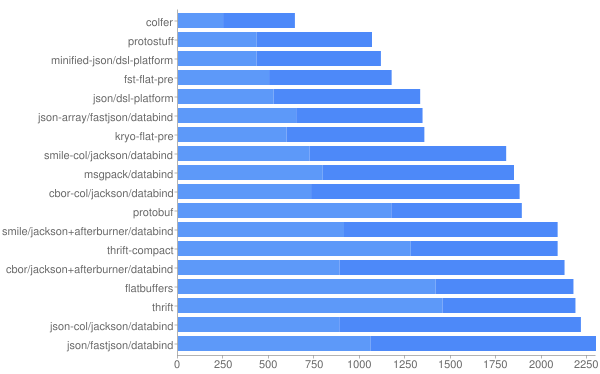
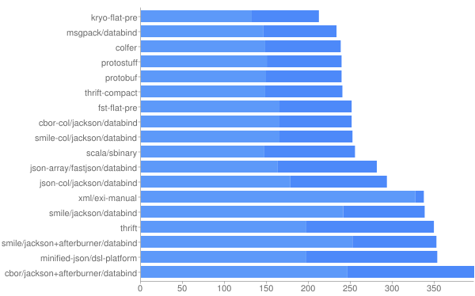

# 编解码

## 什么是编解码？

数据以  形态在网络中传输，这些数据并不能直接被程序所理解，只是一堆无用的字节序列，因而要建立约束规则，发送和接收时同时遵守，才可以将客户端请求数据在服务端进行还原，数据在由应用程序写入到网络的过程即为编码，

## TCP粘包、拆包

我们在应用程序中所处理的消息，由于TCP不了解上层业务数据，可能会将一个报文信息拆开发送（拆包），或者多个报文信息组合发送（粘包），导致接收端无法正确理解数据含义，解码错误。


具体原因大致如下：

1. 发送缓冲区过小，数据无法一次发出，这将会发生拆包。
2. 数据远小于发送缓冲区，导致多个数据报文堆积一起发送，这将会发生粘包。
3. 进行MSS（最大报文长度）大小的TCP分段，当TCP报文长度-TCP头部长度>MSS的时候将发生拆包。
4. 接收方法不及时读取缓冲区数据，这将发生粘包。


##  编解码框架效率对比

我们平时已经接触过一些编解码的协议，比如json，xml，以及java自带的

这里简单介绍几种

protobuf


选择编解码框架要考虑很多因素 

1. 跨语言支持
2. 功能
3. 社区
4. ...

而性能上主要关注以下两点

1. 编解码效率
2. 编码后码流大小

针对各种编解码协议，github上[jvm-serializers](#https://github.com/eishay/jvm-serializers/wiki) 项目对各个编解码框架进行了测评。里面涉及的参数比较多，有需求可以戳进去自己看下，放两张图，这里就不再展开。






## netty编解码实现
netty主要提供四个基础类

 - ByteToMessageDecoder 
 - MessageToMessageDecoder 
 - MessageToByteEncoder
 - MessageToMessageEncoder


ByteToMessageDecoder

是解码器的基础，

解码过程大体如下：

1. 累加数据 
2. 将累加到的数据传递给业务进行业务拆包 
3. 清理字节容器 
4. 传递业务数据包给业务解码器处理

下面结合代码详细分析，具体的使用方法类注释上已经进行了详细说明

首先通过累加器对ByteBuf内的数据进行聚合，

```
public interface Cumulator {
    ByteBuf cumulate(ByteBufAllocator alloc, ByteBuf cumulation, ByteBuf in);
}
```

累加器实际上就是一个接口，有一个cumulate方法。


ByteToMessageDecoder中提供了两种累加器。

```
public static final Cumulator MERGE_CUMULATOR
public static final Cumulator COMPOSITE_CUMULATOR
```

- MERGE_CUMULATOR 合并累加器，通过内存拷贝实现累加
- COMPOSITE_CUMULATOR 复合累加器，通过指针引用复合实现累加，具体使用的是CompositeByteBuf

netty使用MERGE_CUMULATOR作为默认累加器，为什么呢？方法注释里这样解释

​    CompositeByteBuf使用了一套更加复杂的索引实现，因此依赖于使用场景和解码实现，可能会比直接使用MERGE_CUMULATOR还要慢。

解码器本质上也是一个ChannelInboundHandler，因此其读取到数据首先要经由channelRead方法读入处理。

```java
public void channelRead(ChannelHandlerContext ctx, Object msg) throws Exception {
    if (msg instanceof ByteBuf) {
        CodecOutputList out = CodecOutputList.newInstance();
        try {
            ByteBuf data = (ByteBuf) msg;
            first = cumulation == null;
            if (first) {
                cumulation = data;
            } else {
                cumulation = cumulator.cumulate(ctx.alloc(), cumulation, data);
            }
            callDecode(ctx, cumulation, out);
        } catch (DecoderException e) {
            throw e;
        } catch (Exception e) {
            throw new DecoderException(e);
        } finally {
            if (cumulation != null && !cumulation.isReadable()) {
                numReads = 0;
                cumulation.release();
                cumulation = null;
            } else if (++ numReads >= discardAfterReads) {
                // We did enough reads already try to discard some bytes so we not risk to see a OOME.
                // See https://github.com/netty/netty/issues/4275
                numReads = 0;
                discardSomeReadBytes();
            }

            int size = out.size();
            decodeWasNull = !out.insertSinceRecycled();
            fireChannelRead(ctx, out, size);
            out.recycle();
        }
    } else {
        ctx.fireChannelRead(msg);
    }
}
```

核心方法是callDecode(ctx, cumulation, out);方法，方法如下：


基于ByteToMessageDecoder实现解码器仍有难度，netty封装了成熟的解码器用于结局TCP粘包、拆包问题。

- DelimiterBasedFrameDecoder 消息边界
- FixedLengthFrameDecoder 固定长度
- LengthFieldBasedFrameDecoder 消息头指定消息长度
- LineBasedFrameDecoder  回车换行符


参考文献

[jvm-serializers](https://github.com/eishay/jvm-serializers/wiki)