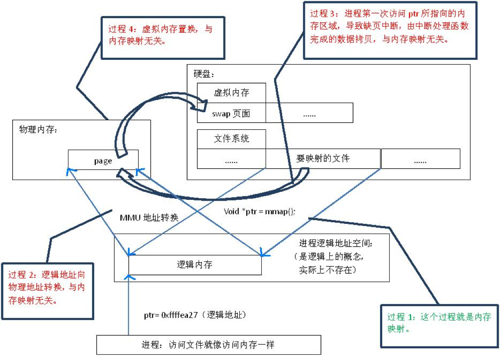
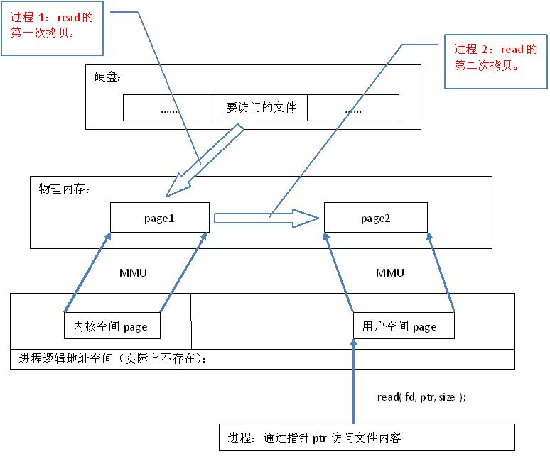

# 零拷贝机制

## 1. 什么是零拷贝

零拷贝是netty重要特性之一，类似的分析文章也看过很多，但是依然存在疑惑，这里进行一下整理

>"Zero-copy" describes computer operations in which the CPU does not perform the task of copying data from one memory area to another.

## 2. 何时发生拷贝

要想避免不必要的拷贝操作发生，首先要知道拷贝何时发生，主要存在以下几种情况：

  1. 内存拷贝，内核空间和用户空间之间的数据拷贝
  2. buffer操作，buffer拼接与拆分
  3. 文件读写操作

## 3. 零拷贝实现

### 3.1 内核空间和用户空间之间的数据拷贝


#### 3.1.1 用户态与内核态

>**用户态**：当进程运行应用程序代码，称之为运行在用户态；
>**内核态**： 当一个任务（进程）执行系统调用而陷入内核代码中执行时，称其运行在内核态，执行的内核代码会使用当前进程的内核栈

可以简单理解为内核态是操作系统层面，用户态是应用程序层面，操作系统为控制访问权限，应用程序访问系统资源就触发系统调用需要切换到内核态，处理完成之后再切回到用户态。

#### 3.1.2 用户空间与内核空间

 >Linux的虚拟地址空间也为0～4G。Linux内核将这4G字节的空间分为两部分。将最高的1G字节（从虚拟地址0xC0000000到0xFFFFFFFF），供内核使用，称为“**内核空间**”。而将较低的3G字节（从虚拟地址 0x00000000到0xBFFFFFFF），供各个进程使用，称为“**用户空间**）。因为每个进程可以通过系统调用进入内核，因此，Linux内核由系统内的所有进程共享。于是，从具体进程的角度来看，每个进程可以拥有4G字节的虚拟空间。

简而言之，用户空间就是服务于用户态的，这里有两点需要注意

 1. 进程的私有空间都系统中的其他进程不可见
 2. 内核空间为所有进程和内核共享

通常应用程序读取网络数据首先通过系统调用切换到内核态，获取到数据会暂存内核空间，然后切换到用户态，再将数据拷贝到用户空间进行进一步处理，同样，写操作也是这样，现在用户空间构造数据，切换到内核态准备发送，将数据从用户空间拷贝到内核空间，发送数据，具体过程如下：


#### 3.1.3 直接内存(堆外内存)与堆内存

>**堆内存**：java内存模型中最大的一部分，用于存放由new创建的对象和数组。
>
>**直接内存**：JDK1.4 加入了新的 NIO 机制，此后 NIO 可以使用 Native 的方式直接在 内核空间分配内存。这部分不受 JVM 堆内存大小限制，JVM可以通过-XX:MaxDirectMemorySize对Direct Memory大小进行限制。达到操作系统内存上限仍会触发OutOfMemoryError 

直接内存与堆内存比较分析

 1. 性能问题
直接内存的访问性能更好，但分配相对于直接内存来说较慢
直接内存不会触发GC，提高吞吐量
 2. 安全问题
直接内存不受JVM控制，更加不可控，系统内存资源耗尽会触发OOM异常，发生内存泄露难以排查
 3. 开发成本
堆内存使用更加方便直接，内存分配回收交由jvm管理。而直接内存的学习和维护成本都很高，出错的几率更大。

netty针对这两种buffer都有实现，堆内存存储数据形态为字节数组byte[]，直接内存为ByteBuffer

#### 3.1.4 netty的处理方式

netty启动时默认会**在内核空间分配一个直接内存池**，进程在内核态和用户态都可访问，这样就无需再对与外界的交互数据进行二次拷贝。这部分内容会在后面的文章具体分析netty是如何管理内存的。

### 3.2 buffer的拼接与拆分

涉及到一些对缓存的操作，诸如将一个缓存拆分，将多个缓存合并，TCP会将报文拆分发送，这样的操作在网络IO中非常频繁，通常这样的操作需重新建一个字节数组，然后进行复制操作，而netty则无需这个操作，直接将指针拼接，对外呈现为一个整体，而数据仍保留在原来的内存区域。即操作值和操作址的区别

#### 3.2.1 CompositeByteBuf 复合缓存

将多个ByteBuf对象进行拼接，只是将引用进行聚合，逻辑上形成一个整体，Bytebuf对象指向的数据并未发生拷贝。
addComponents(int cIndex, ByteBuf... buffers) ，我们直接看最终调用的方法，如下：

```
private int addComponent0(boolean increaseWriterIndex, int cIndex, ByteBuf buffer) {
    assert buffer != null;
    boolean wasAdded = false;
    try {
        checkComponentIndex(cIndex);

        int readableBytes = buffer.readableBytes();

        // No need to consolidate - just add a component to the list.
        @SuppressWarnings("deprecation")
        Component c = new Component(buffer.order(ByteOrder.BIG_ENDIAN).slice());
        if (cIndex == components.size()) {
            wasAdded = components.add(c);
            if (cIndex == 0) {
                c.endOffset = readableBytes;
            } else {
                Component prev = components.get(cIndex - 1);
                c.offset = prev.endOffset;
                c.endOffset = c.offset + readableBytes;
            }
        } else {
            components.add(cIndex, c);
            wasAdded = true;
            if (readableBytes != 0) {
                updateComponentOffsets(cIndex);
            }
        }
        if (increaseWriterIndex) {
            writerIndex(writerIndex() + buffer.readableBytes());
        }
        return cIndex;
    } finally {
        if (!wasAdded) {
            buffer.release();
        }
    }
}
```

#### 3.2.2 Derived ByteBuf 衍生缓存（或子缓存）

如下四个方法：

 - duplicate()
 - slice()
 - slice(int, int)
 - readSlice(int)
 - retainedDuplicate()
 - retainedSlice()
 - retainedSlice(int, int)
 - readRetainedSlice(int)

调用上述方法会重新返回一个原Bytebuf对象的子缓存对象，这个生成的对象有自己单独的读写索引，但会与原缓存对象共用存储数据和引用计数器，即Bytebuf指向的内部数据无需拷贝。
若要完全复制一个Bytebuf对象，通过调用copy()方法实现

#### 3.2.3 ByteBuf 包装

主要为wrap()方法，实际上就是基于传入的传入的byte[]或者ByteBuffer，调用构造函数创建一个新的ByteBuf对象，构造方法中调用了slice()方法，源码很清晰也很简洁，限于篇幅这里就不做展示了。感兴趣可以看下以Unpooled#wrappedBuffer(ByteBuffer buffer)方法。

### 3.3 文件读写操作

通常文件拷贝或发送会将内容先加载到内存中，然后再进行相应的操作
大文件操作不同于网络IO，通常数据量比较大，对其内容全部加载到内存中，代价较大
netty通过FileRegion实现文件传输零拷贝，FIleRegion为接口，其默认实现类为DefaultFileRegion，底层通过Java NIO FileChannel.transfer实现

>**虚拟内存**，简单说就是以磁盘充当物理内存，将不活跃的内存数据存储在磁盘上，主存中只保存活动区域，暂缓内存资源不足，待访问这些数据时，通过响应缺页中断将数据从磁盘置换到物理内存中。

> **内存文件映射，**由一个文件到进程地址空间的映射，在内存映射的过程中，并没有实际的数据拷贝，文件没有被载入内存，只是逻辑上被放入了内存，“像访问普通内存一样对文件进行访问”

java中对应MappedByteBuffer类，通过这个类进一步了解一下内存文件机制的原理
类文件注释上有这样一段话

> This is a little bit backwards: By rights MappedByteBuffer should be a subclass of DirectByteBuffer, but to keep the spec clear and simple, and for optimization purposes, it's easier to do it the other way around.  This works because DirectByteBuffer is a package-private class.

MappedByteBuffer本该是DirectByteBuffer的子类，可以理解为MappedByteBuffer就是直接内存的一种，被映射的字节缓冲区与正常的直接字节缓冲区并无区别。




内存文件映射过程如下：

1.  mmap()会返回一个指针ptr，它指向进程逻辑地址空间中的一个地址
2.  内存文件映射不会触发实质性的数据拷贝，访问逻辑地址发生缺页中断，将磁盘数据加载到物理内存中

内存文件映射与虚拟内存有相似之处，但不能混为一谈。 

*  相似之处：数据都是存储在磁盘上，内存中通过维护引用，在需要数据时快速加载到内存中
*  不同之处：目标不同：虚拟内存是扩展内存资源，内存文件映射用来访问文件




内存文件映射相较于传统的IO流读写要快很多，原理与网络IO类似，传统的IO调用读写方法为系统调用，数据需要将数据先拷贝到内核空间，再拷贝到用户空间，发生两次数据拷贝。内存文件映射也是系统调用，但其并未进行数据拷贝，数据的拷贝实际上是通过缺页中断实现的。这部分数据由于映射到用户空间，所以仅需一次“拷贝”即可完成数据读取。

### 3.4 潜在的拷贝操作

netty虽然在很多需要拷贝的地方做了优化，但是要注意的是并非消息从读取到写出的整个处理周期都不会发生拷贝，后面我们会提到消息的解码过程实际上是发生内存拷贝的。

### 3.5 总结

1. 使用池化直接内存减少网络IO用户空间和内核空间的拷贝；
2. 使用指针操作缓存对象指向的内存数据而不发生实际的数据拷贝；
3. 使用DefaultFileRegion实现减少文件读写操作时用户空间和内核空间的拷贝。

## 4. 零拷贝的其它实现

 直接内存访问（DMA）

> 在实现DMA传输时，是由DMA控制器直接掌管总线，因此，存在着一个总线控制权转移问题。即DMA传输前，CPU要把总线控制权交给DMA控制器，而在结束DMA传输后，DMA控制器应立即把总线控制权再交回给CPU。一个完整的DMA传输过程必须经过DMA请求、DMA响应、DMA传输、DMA结束4个步骤。

即CPU完成DMA的准备工作，真正的复制工作无需CPU参与，由DMA完成即可。


参考文章
https://my.oschina.net/javahongxi/blog/1523771