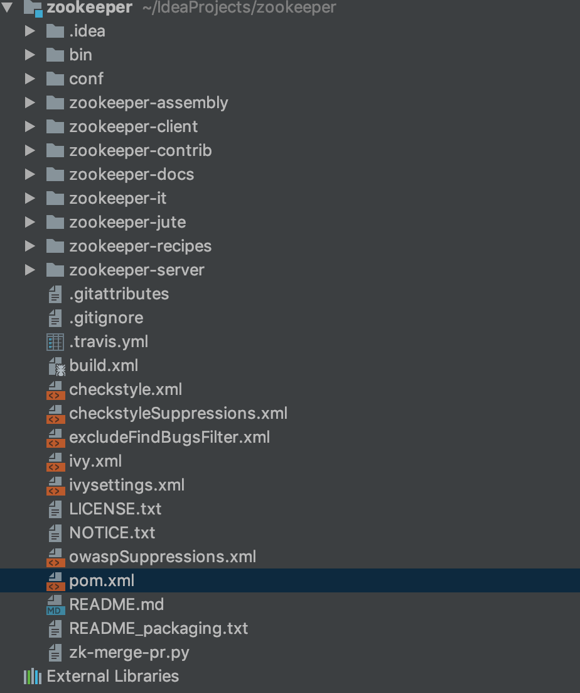

# zookeeper源码

[TOC]


## 源码结构



- server：服务端代码
- client：客户端代码，C语言编写


## 源码导读

### 客户端API设计与实现

- org.apache.zookeeper.ZooKeeper
- org.apache.zookeeper.ZooKeeperMain

### 序列化与协议

使用JUte组件进行序列化和反序列化，org.apache.jute中详细介绍

### 网络通信

- org.apache.zookeeper.server.NettyServerCnxn
- org.apache.zookeeper.server.NettyServerCnxnFactory

### Watcher机制

服务端和客户端的事件通知机制

- org.apache.zookeeper.Watcher
- org.apache.zookeeper.WatcherEvent
- org.apache.zookeeper.ClientWatchManager
- org.apache.zookeeper.Zookeeper.ZKWatchManager

### 数据与存储

- org.apache.zookeeper.server.persistence
- org.apache.zookeeper.server.quorum.LearnerHandler

### 请求处理链

PreRequestProcessor,ProposalRequestProcessor,SyncRequestProcessor

### Leader选举

#### 选举算法接口定义

- org.apache.zookeeper.server.quorum.Election

#### 选举算法的3中实现

- org.apache.zookeeper.server.quorum.AuthFastLeaderElection
- org.apache.zookeeper.server.quorum.LeaderElection
- org.apache.zookeeper.server.quorum.FastLeaderElection

#### 网络通信

- org.apache.zookeeper.server.quorum.QuorumCnxManager


### 服务端角色

三种角色Leader,Follower,Observer

#### 集群模式下服务器基本功能定义

- org.apache.zookeeper.server.ZooKeeperServer
- org.apache.zookeeper.server.quorum.QuorumZooKeeperServer

3中服务器角色

- org.apache.zookeeper.server.quorum.LeaderZooKeeperServer
- org.apache.zookeeper.server.quorum.FollowerZooKeeperServer
- org.apache.zookeeper.server.quorum.ObserverZooKeeperServer


### ZAB协议相关

- org.apache.zookeeper.server.quorum.Leader
- org.apache.zookeeper.server.quorum.Follower
- org.apache.zookeeper.server.quorum.LearnerHandler


### 权限认证

默认提供Digest，IP和SASL三种权限认证模式

- org.apache.zookeeper.server.auth


## 源码构建

```xml
mvn install -DskipTests
```


