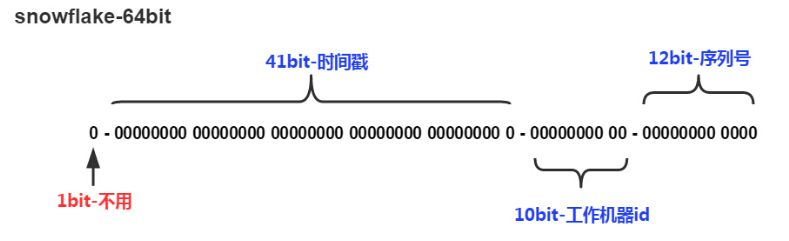

# 分布式ID

## 为什么需要分布式ID

通常引入分布式唯一ID用于解决分库分表中全局唯一主键问题。


## 常用解决方案

### UUID（Universally Unique Identifier，通用唯一识别码）

形式为8-4-4-4-1，由32个字符以及4个横线组成，占36Byte，示例：550e8400-e29b-41d4-a716-446655440000

UUID理论上的总数为16^32，约等于3.4 x 1038。也就是说若每[纳秒](https://zh.wikipedia.org/wiki/%E7%BA%B3%E7%A7%92)产生1[兆](https://zh.wikipedia.org/wiki/%E5%85%86)个UUID，要花100亿年才会将所有UUID用完，而其重复的概率也是微乎其微，几乎无需关心。

UUID可以通过JDK自带的工具类生成

``` java
 String uuid  = UUID.randomUUID().toString();
```

- 优点：
  - 本地生成，不需要中心服务，实现简单
  - 无需额外网络请求，低延迟
- 缺点
  - 空间需求大；需36Byte，相比其他解决方案来说偏大。若作为Innodb聚簇索引会额外增大二级索引存储空间，
  - 无序，作为主键索引，插入时会频繁改动索引结构，插入性能降低。

所以生成环境很少有直接将uuid作为主键来使用，如果使用uuid作为全局唯一标识，建议设置自增ID来提高性能。

### 数据库自增ID

利用数据库自增主键，向数据库中插入数据并获取到自增ID，基于数据库建立一个额外的中心服务，提供接口，每次需要生成ID请求服务即可。

``` sql
 BEGIN;
 REPLACE INTO  Uid(uid) VALUES (0);
 SELECT LAST_INSERT_ID()
 COMMIT;
```

- 优点
  - 实现相对简单，仅通过Sql语句向外暴露接口即可。
  - 适用一些要求保证ID顺序的场景
- 缺点
  - 数据库存在性能瓶颈。
  - 强依赖数据库，存在单点问题，一旦数据库挂掉，服务不可用

### 雪花算法（snowflake）

​         通过时间戳、机器ID以及单机序列号生成唯一ID，具体的位分配可以根据实际应用场景自行调整。若以下图标准的snowflake为例，可以最大同时允许1024台机器组成服务集群，每台机器每秒可发8192个。



- 优点
  1. 有序，保证呈递增趋势，可以减少索引操作；
  2. 字段相对较短，64bit，占8Byte，只需要一个bigint就可以存下.
- 缺点
  1. 需用户自己定义机器ID。
  2. 依赖时间戳，存在时钟回滚的风险，会导致出现重复发号


https://juejin.im/post/5bb0217ef265da0ac2567b42?utm_source=gold_browser_extension